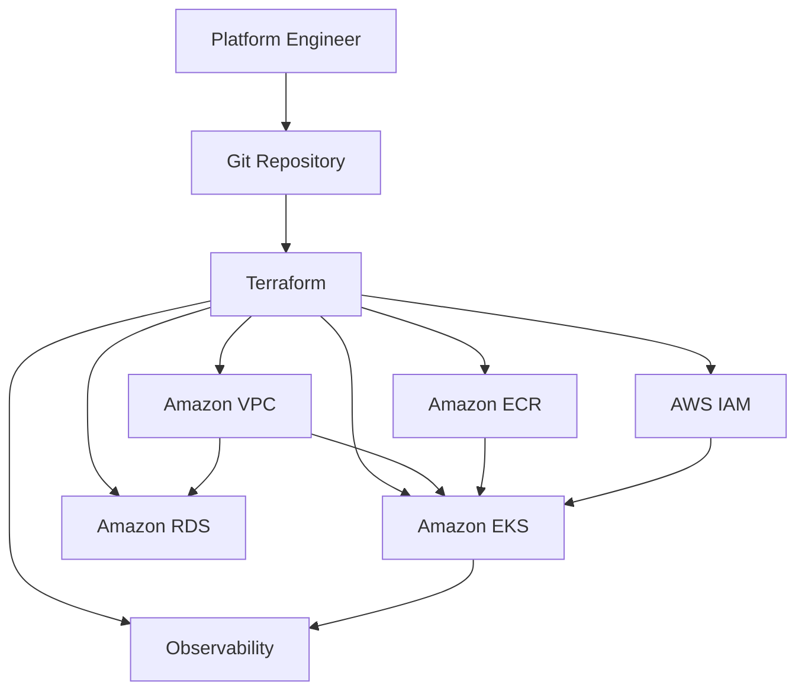

# AWS Platform Sample

`aws-platform-sample` is an Infrastructure as Code repository for building and managing a sample AWS platform using Terraform.

The repository is intended to become the single source of truth for AWS infrastructure, environment configuration, IAM policies, operational scripts, and infrastructure documentation.

> **Current status:** The repository structure has been initialized. AWS resources and Terraform modules will be implemented incrementally.

## Project Goal

The goals of this project are to:

- Provision AWS infrastructure using Terraform.
- Store all infrastructure code in a single Git repository.
- Support separate `dev`, `staging`, and `production` environments.
- Create reusable Terraform modules for common AWS services.
- Keep environment-specific configuration separate from reusable infrastructure logic.
- Manage infrastructure changes through Git commits and pull requests.
- Provide documentation for architecture, deployment, security, and operations.
- Avoid storing credentials, Terraform state files, or sensitive values in Git.

The planned platform includes:

- Amazon VPC and networking
- Amazon ECR
- Amazon EKS
- Amazon RDS
- AWS IAM
- Monitoring and observability resources

## Repository Structure

```text
aws-platform-sample/
├── README.md
├── .gitignore
├── .github/
│   └── .gitkeep
├── docs/
│   ├── architecture.md
│   ├── deployment-guide.md
│   ├── operations-guide.md
│   ├── security.md
│   └── diagrams/
├── terraform/
│   ├── modules/
│   │   ├── networking/
│   │   ├── ecr/
│   │   ├── eks/
│   │   ├── rds/
│   │   ├── iam/
│   │   └── observability/
│   └── environments/
│       ├── dev/
│       ├── staging/
│       └── production/
├── scripts/
│   ├── check-prerequisites.sh
│   ├── terraform-init.sh
│   ├── terraform-plan.sh
│   ├── terraform-apply.sh
│   └── terraform-destroy.sh
└── policies/
    ├── github-actions-trust-policy.json
    ├── terraform-plan-policy.json
    ├── terraform-apply-policy.json
    └── README.md
```

### Directory Responsibilities

| Path | Description |
|---|---|
| `.github/` | Reserved for future GitHub configuration and automation |
| `docs/` | Architecture, deployment, security, and operational documentation |
| `docs/diagrams/` | Architecture and infrastructure diagrams |
| `terraform/modules/` | Reusable Terraform modules for AWS services |
| `terraform/environments/` | Environment-specific Terraform configurations |
| `scripts/` | Helper scripts for Terraform operations |
| `policies/` | IAM policies and trust policies used by the platform |

## Terraform Structure

The Terraform code is separated into two main layers.

### Modules

Modules contain reusable infrastructure logic:

- `networking`: VPC, subnets, route tables, gateways, and security groups
- `ecr`: Container image repositories
- `eks`: Kubernetes cluster and managed node groups
- `rds`: Relational database resources
- `iam`: IAM roles, policies, and service permissions
- `observability`: Logging, metrics, alarms, and dashboards

Each module follows this structure:

```text
module-name/
├── main.tf
├── variables.tf
├── outputs.tf
├── versions.tf
└── README.md
```

### Environments

Environment directories define environment-specific values and call the reusable modules.

```text
terraform/environments/
├── dev/
├── staging/
└── production/
```

Each environment uses an independent Terraform configuration and state. This separation reduces the risk of changes in one environment affecting another environment.

## Architecture Overview

The following diagram represents the planned high-level architecture:



### Infrastructure Flow

1. Infrastructure changes are written in Terraform.
2. Changes are committed to a feature branch.
3. A pull request is created for review.
4. Terraform formatting, validation, security scanning, and planning will be performed.
5. Approved changes are merged into the `main` branch.
6. Terraform applies the approved infrastructure changes to the selected AWS environment.

## Environment Strategy

| Environment | Purpose |
|---|---|
| `dev` | Development and infrastructure testing |
| `staging` | Pre-production validation |
| `production` | Production workloads |

Each environment should have an independent Terraform state, environment-specific variables, resource naming, network configuration, and IAM permissions.

Recommended naming convention:

```text
<project>-<environment>-<resource>
```

Examples:

```text
aws-platform-dev-vpc
aws-platform-staging-eks
aws-platform-production-rds
```

## Prerequisites

Install and configure:

- Git
- Terraform
- AWS CLI
- An AWS account with appropriate permissions

Verify the required tools:

```bash
git --version
terraform version
aws --version
aws sts get-caller-identity
```

## Getting Started

Clone the repository:

```bash
git clone https://github.boschdevcloud.com/TBA9HC/aws-platform-sample.git
cd aws-platform-sample
```

Select an environment:

```bash
cd terraform/environments/dev
```

Initialize and validate Terraform:

```bash
terraform init
terraform fmt -recursive
terraform validate
terraform plan
```

Apply the planned changes:

```bash
terraform apply
```

> Terraform commands will become functional after the required providers, backend configuration, modules, variables, and AWS resources are implemented.

## Terraform State

Each environment should use a separate remote Terraform state. Terraform state files must never be committed to Git.

The following files should be excluded:

```text
.terraform/
*.tfstate
*.tfstate.*
*.tfplan
*.tfvars
crash.log
```

Only example variable files should be committed, such as `terraform.tfvars.example`.

Because this repository does not contain a bootstrap module, remote state infrastructure must be provisioned separately before enabling an S3 backend.

## Security Principles

- Do not commit AWS credentials or sensitive values.
- Do not commit Terraform state or real `.tfvars` files.
- Use least-privilege IAM permissions.
- Use separate roles for Terraform plan and apply operations.
- Encrypt data at rest and in transit.
- Block public access unless explicitly required.
- Review infrastructure changes before applying them.
- Require additional approval for production changes.

## Development Workflow

Create a feature branch:

```bash
git checkout -b feature/add-networking-module
```

Validate and commit the changes:

```bash
terraform fmt -recursive
terraform validate
git add .
git commit -m "feat: add networking module"
git push -u origin feature/add-networking-module
```

Create a pull request and merge it only after the infrastructure changes have been reviewed.

## Documentation

- [`docs/architecture.md`](docs/architecture.md)
- [`docs/deployment-guide.md`](docs/deployment-guide.md)
- [`docs/operations-guide.md`](docs/operations-guide.md)
- [`docs/security.md`](docs/security.md)

## Roadmap

- [x] Initialize the repository structure
- [ ] Configure Terraform and AWS providers
- [ ] Implement the networking module
- [ ] Implement IAM roles and policies
- [ ] Implement ECR repositories
- [ ] Implement the EKS cluster
- [ ] Implement the RDS database
- [ ] Implement monitoring and logging
- [ ] Configure remote Terraform state
- [ ] Add infrastructure validation and deployment automation
- [ ] Deploy and validate the `dev` environment
- [ ] Prepare `staging` and `production` environments

## License

This repository is intended for internal learning and demonstration purposes.
