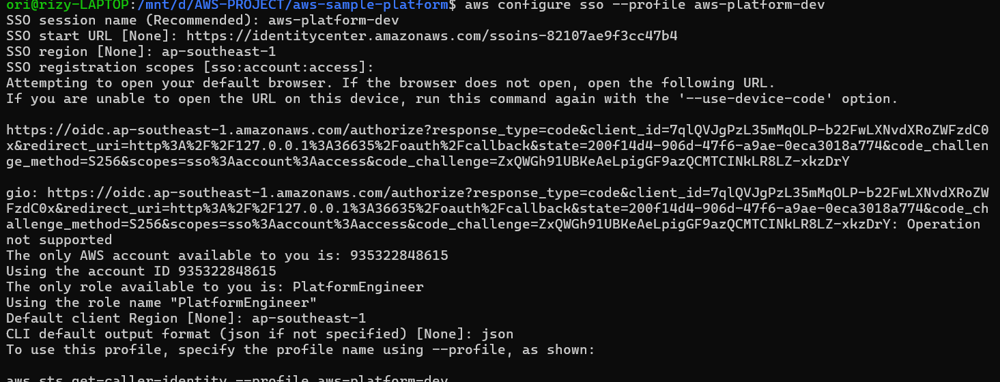
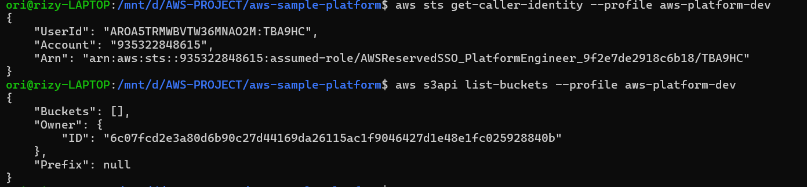

# AWS CLI SSO Authentication

## Overview

AWS CLI supports authentication through AWS IAM Identity Center using temporary credentials.

Instead of configuring long-lived Access Keys, project contributors sign in through the AWS Access Portal and use their assigned Permission Set to run AWS CLI commands.

This project uses an AWS CLI SSO profile for secure command-line access to the AWS account.

---

# Objective

Configure AWS CLI authentication using AWS IAM Identity Center, verify the authenticated identity, and execute AWS CLI commands without using long-lived Access Keys.

---

# Why This Matters

Long-lived Access Keys increase security risk because they must be stored locally and manually rotated.

AWS CLI SSO provides several advantages:

- Temporary AWS credentials
- No locally stored Secret Access Keys
- Centralized authentication through IAM Identity Center
- Authorization through assigned Permission Sets
- Improved traceability and access control
- Automatic credential retrieval and renewal during an active SSO session

---

# Configuration

## AWS CLI SSO Profile

| Item | Value |
|------|-------|
| Authentication Method | AWS IAM Identity Center |
| Profile Name | `aws-platform-dev` |
| SSO Session Name | `aws-platform-dev` |
| SSO Region | `ap-southeast-1` |
| Default Client Region | `ap-southeast-1` |
| Default Output Format | `json` |
| Permission Set | `PlatformEngineer` |
| Credential Type | Temporary credentials |
| Long-lived Access Keys | Not used |

The SSO Start URL and AWS account identifiers are intentionally omitted from this document.

---

# Authentication Flow

```text
Project Contributor
        |
        v
AWS CLI SSO Profile
        |
        v
AWS IAM Identity Center
        |
        v
PlatformEngineer Permission Set
        |
        v
Temporary AWS Credentials
        |
        v
AWS CLI Commands
```

---

# Implementation

The AWS CLI SSO profile was configured using the interactive SSO wizard:

```bash
aws configure sso --profile aws-platform-dev
```

The wizard performed the following actions:

1. Registered the AWS CLI SSO session.
2. Opened the browser-based IAM Identity Center authorization flow.
3. Selected the assigned AWS account.
4. Selected the `PlatformEngineer` Permission Set.
5. Configured `ap-southeast-1` as the default client Region.
6. Configured JSON as the default output format.

The profile configuration is stored in the local AWS CLI configuration file. No Access Key ID or Secret Access Key was created or stored.

---

# Usage

Authenticate the SSO profile before running AWS CLI commands:

```bash
aws sso login --profile aws-platform-dev
```

Verify the current AWS identity:

```bash
aws sts get-caller-identity --profile aws-platform-dev
```

Run a read-only AWS CLI command:

```bash
aws s3api list-buckets --profile aws-platform-dev
```

Sign out and remove locally cached SSO sessions when required:

```bash
aws sso logout
```

---

# Credential Behavior

AWS CLI uses the IAM Identity Center session to retrieve temporary AWS role credentials.

- The local profile stores SSO configuration, not long-lived credentials.
- The authenticated session is cached locally for a limited period.
- AWS CLI retrieves temporary credentials for the `PlatformEngineer` role.
- When the SSO session expires, the user must authenticate again with `aws sso login`.
- The AWS CLI SSO cache and local AWS configuration must not be committed to Git.

---

# Verification

The following verification steps have been completed:

- The `aws-platform-dev` AWS CLI SSO profile was configured successfully.
- Authentication was completed through AWS IAM Identity Center.
- The assigned `PlatformEngineer` Permission Set was selected.
- `aws sts get-caller-identity` returned the expected AWS account and assumed SSO role.
- `aws s3api list-buckets` executed successfully without authentication or authorization errors.
- No long-lived Access Key ID or Secret Access Key was used.

The successful STS response confirms that AWS CLI retrieved temporary credentials for an IAM Identity Center role rather than authenticating as the root user or an IAM user.

---

# Security Considerations

- Do not create Access Keys for human AWS CLI access.
- Do not add SSO tokens or AWS CLI configuration files to the repository.
- Always specify the intended profile when multiple AWS CLI profiles exist.
- Verify the active identity before performing infrastructure operations.
- Pass the AWS Region explicitly when a command could affect a different Region.
- Allow cached SSO credentials to expire or run `aws sso logout` after use on a shared device.
- Redact AWS account identifiers, SSO URLs, role ARNs, user identifiers, and authorization URLs before publishing screenshots.

---

# Lessons Learned

- AWS IAM Identity Center separates user authentication from AWS authorization.
- Permission Sets determine which AWS operations an authenticated user can perform.
- AWS CLI SSO retrieves temporary credentials automatically during an active session.
- Named profiles allow multiple AWS identities and environments to coexist safely on one workstation.
- `aws sts get-caller-identity` is an important verification step before running infrastructure commands.
- AWS CLI access does not require long-lived Access Keys for IAM Identity Center users.

---

# Screenshots

## AWS CLI SSO Profile Configuration



---

## AWS CLI Authentication Verification



---

# References

- [Configuring IAM Identity Center authentication with the AWS CLI](https://docs.aws.amazon.com/cli/latest/userguide/cli-configure-sso.html)
- [AWS CLI `configure sso` command reference](https://docs.aws.amazon.com/cli/latest/reference/configure/sso.html)
- [AWS IAM Identity Center documentation](https://docs.aws.amazon.com/singlesignon/)
- [AWS CLI configuration and credential file settings](https://docs.aws.amazon.com/cli/latest/userguide/cli-configure-files.html)
