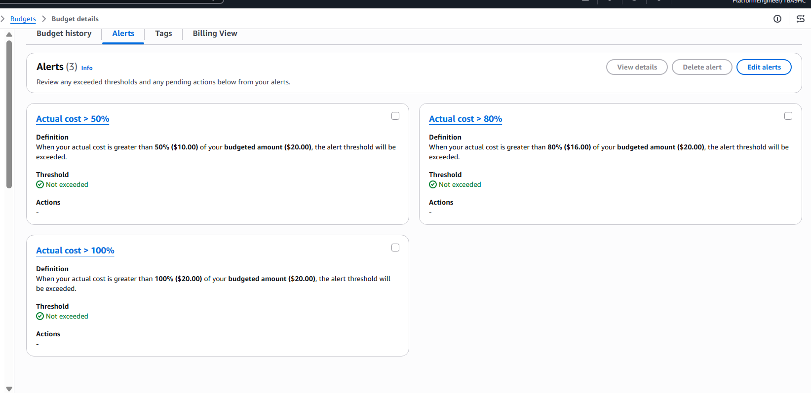
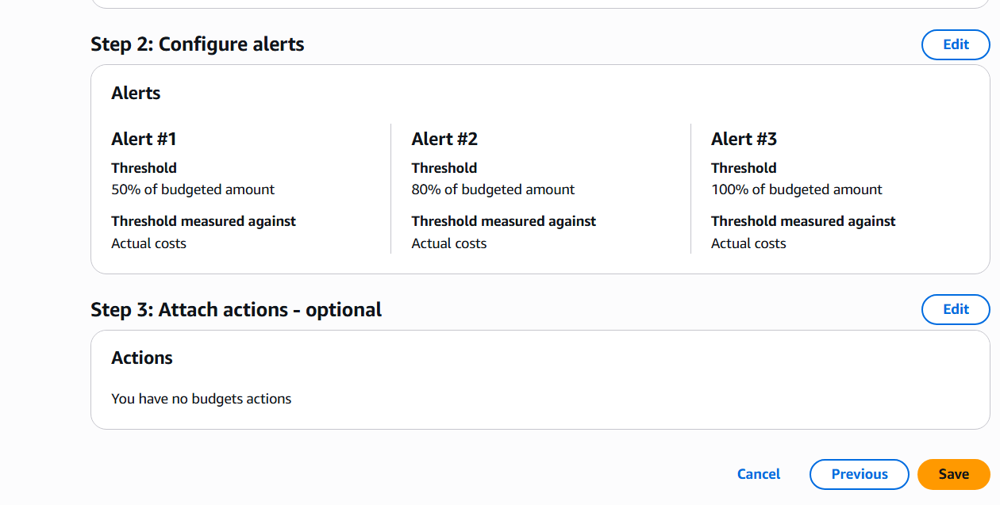

# AWS Budget Alerts

## Overview

AWS Budgets alerts provide proactive notifications when monthly AWS spending reaches predefined thresholds.

This project uses email alerts to notify the team as actual monthly costs approach or exceed the configured budget of **20 USD**.

---

# Objective

Configure budget alerts at 50%, 80%, and 100% of the monthly AWS budget to notify the team before unexpected costs occur.

---

# Why This Matters

AWS resources can continue generating costs when they are no longer actively used or monitored.

Budget alerts provide several benefits:

- Early visibility into increasing AWS costs
- Time to investigate unexpected usage
- Opportunity to stop or remove unnecessary resources
- Improved cost awareness across the project team
- Reduced risk of exceeding the monthly cost limit

---

# Budget Alert Configuration

The alerts are attached to the existing monthly cost budget.

| Item | Value |
|------|-------|
| Budget Name | <your-monthly-cost-budget-name> |
| Budget Type | Cost Budget |
| Budget Period | Monthly |
| Budget Amount | 20 USD |
| Cost Basis | Actual cost |
| Notification Method | Email |
| Amazon SNS | Not enabled |
| Budget Actions | Not configured |

---

## Alert Thresholds

| Alert Level | Threshold | Amount | Cost Type | Notification |
|-------------|----------:|-------:|-----------|--------------|
| Warning | 50% | 10 USD | Actual cost | Email |
| High | 80% | 16 USD | Actual cost | Email |
| Critical | 100% | 20 USD | Actual cost | Email |

Each alert uses a percentage of the budgeted amount and is evaluated against actual monthly costs.

---

# Alert Strategy

## 50% Alert

The 50% alert provides an early warning when actual monthly spending exceeds **10 USD**.

At this stage, the team should review active resources and confirm that current costs are expected.

## 80% Alert

The 80% alert indicates that actual monthly spending has exceeded **16 USD** and is approaching the monthly budget.

The team should identify unnecessary resources and apply corrective actions where appropriate.

## 100% Alert

The 100% alert indicates that actual monthly spending has exceeded the full **20 USD** budget.

The team should immediately investigate the cost increase and stop non-essential resources when safe to do so.

---

# Notification Workflow

```text
AWS Resources Generate Costs
             |
             v
AWS Budgets Evaluates Actual Monthly Cost
             |
             v
Compare Cost Against 50%, 80%, and 100%
             |
             v
Budget Threshold Exceeded
             |
             v
Email Notification Sent to Project Team
             |
             v
Team Reviews Cost and Takes Corrective Action
```

---

# Notification Behavior

- Alerts monitor actual costs rather than forecasted costs.
- Notifications are sent to the configured project email recipient.
- Each actual-cost alert is sent when its threshold is first exceeded during the monthly budget period.
- AWS Budgets data is not updated in real time, so notifications may be delayed while billing data is processed.
- Budget alerts notify the team but do not automatically stop or delete AWS resources.

---

# Verification

The following verification steps confirm the budget alert configuration:

- The monthly cost budget remains configured at 20 USD.
- A 50% actual-cost alert is configured with an email recipient.
- An 80% actual-cost alert is configured with an email recipient.
- A 100% actual-cost alert is configured with an email recipient.
- All three alerts use percentage-based thresholds.
- All three alerts monitor actual monthly costs.
- Amazon SNS and automated Budget Actions are not enabled.

Notification delivery will be validated when actual monthly costs exceed a configured threshold. AWS resources should not be created solely to trigger a budget alert.

---

# Security Considerations

- Email recipients should be limited to authorized project members.
- AWS account identifiers, email addresses, role ARNs, and other private information should be redacted from screenshots before publication.
- Budget modification permissions should be limited to authorized administrators or explicitly approved project roles.
- Budget notifications must not include credentials, secrets, or sensitive application information.

---

# Lessons Learned

- Multiple thresholds provide progressively stronger warnings as costs increase.
- Actual-cost alerts are based on costs already recorded by AWS billing systems.
- Budget notifications support proactive cost management but do not enforce a hard spending limit.
- Email alerts provide a simple notification method without requiring additional infrastructure.
- Cost monitoring should be configured before deploying application infrastructure.

---

# Screenshots

## Budget Alerts Overview



---

## Budget Alert Details



---

# References

- [AWS Budgets documentation](https://docs.aws.amazon.com/cost-management/latest/userguide/budgets-managing-costs.html)
- [Creating a cost budget](https://docs.aws.amazon.com/cost-management/latest/userguide/create-cost-budget.html)
- [AWS Budgets best practices](https://docs.aws.amazon.com/cost-management/latest/userguide/budgets-best-practices.html)
