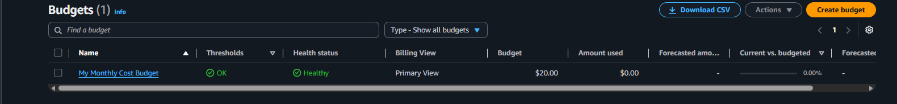
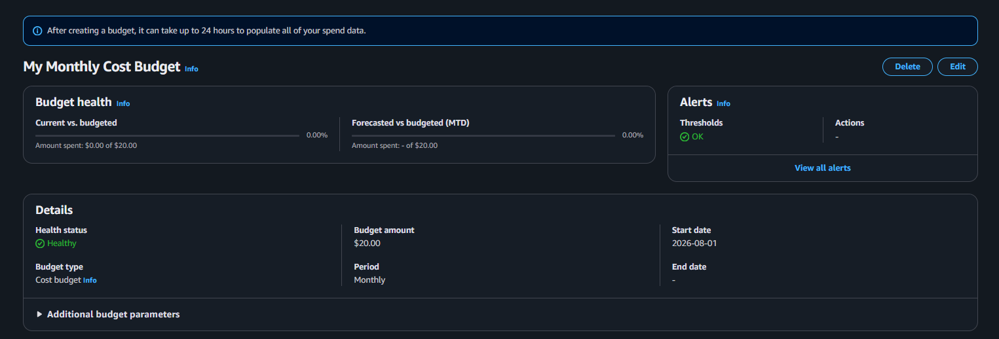

# AWS Budget

## Overview

AWS Budgets is a cost management service that helps monitor AWS spending and provides proactive notifications when spending approaches predefined thresholds.

This project uses AWS Budgets to ensure that the monthly AWS cost remains within the target budget of **20 USD**.

---

# Objective

Create a monthly AWS Budget to monitor project spending and prevent unexpected AWS charges.

---

# Why This Matters

Cloud resources can continue generating costs even when they are not actively used.

Setting up an AWS Budget helps:

- Monitor monthly spending
- Prevent unexpected costs
- Receive early warning before exceeding the budget
- Encourage cost-aware infrastructure design

---

# Budget Configuration

| Item | Value |
|------|-------|
| Budget Type | Cost Budget |
| Budget Period | Monthly |
| Budget Amount | 20 USD |
| Scope | Entire AWS Account |
| Auto Reset | Monthly |

---

# Cost Strategy

The project follows a cost-conscious approach.

Key principles include:

- Use ECS Fargate only when required.
- Destroy infrastructure when it is no longer needed.
- Prefer managed services with lower operational overhead.
- Monitor spending continuously throughout the project.

---

# Budget Workflow

```text
Provision Infrastructure
          │
          ▼
 AWS Cost Increases
          │
          ▼
 AWS Budget Monitors Spending
          │
          ▼
 Compare Against Monthly Budget
          │
          ▼
 Budget Alert Triggered (Issue #7)
```

---

# Verification

The following verification steps have been completed:

- Monthly budget has been created.
- Budget amount is set to 20 USD.
- Budget monitors the entire AWS account.
- Budget status is Active.

---

# Lessons Learned

- AWS Budgets provides proactive cost monitoring.
- Budget monitoring should be configured before provisioning infrastructure.
- Cost management is an important part of operating production workloads.
- A defined budget encourages better infrastructure design decisions.

---

# Screenshots

## Budget Overview



---

## Budget Details



---

# References

- AWS Budgets Documentation
- AWS Cost Management Documentation