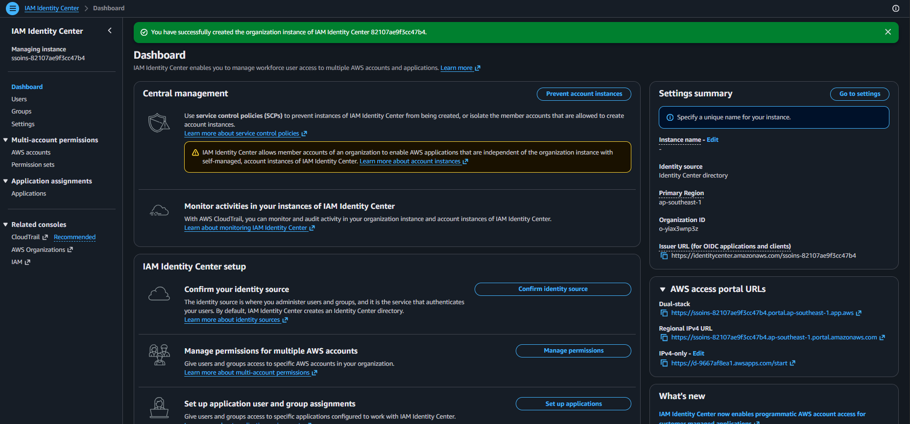
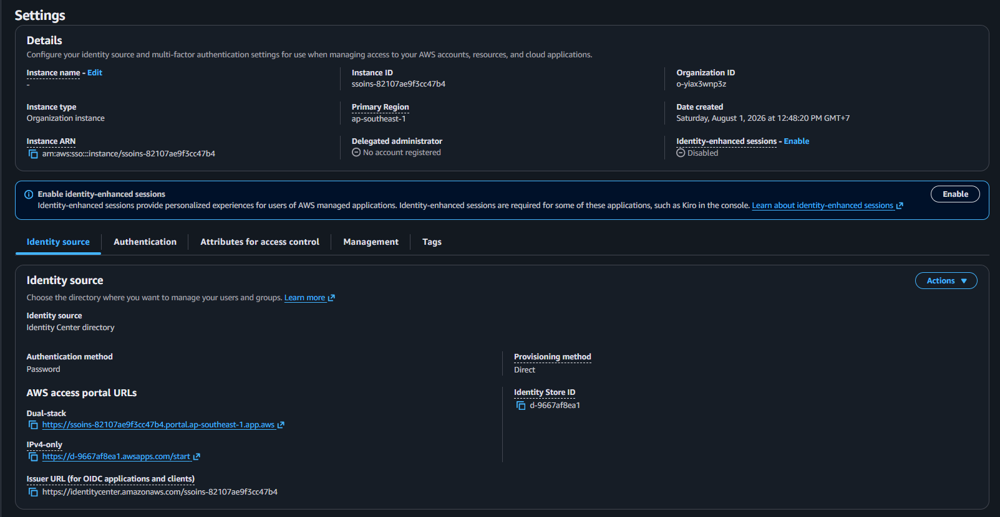

# AWS IAM Identity Center

## Overview

AWS IAM Identity Center (formerly AWS Single Sign-On) provides centralized identity and access management for AWS accounts and applications.

Instead of creating long-lived IAM Users, project members authenticate through IAM Identity Center and receive temporary AWS credentials based on assigned Permission Sets.

This project uses IAM Identity Center as the primary authentication mechanism for all human users.

---

# Objective

Establish centralized identity management for project contributors by enabling AWS IAM Identity Center.

---

# Why This Matters

Managing individual IAM Users becomes increasingly difficult as a project grows.

AWS IAM Identity Center provides several advantages:

- Centralized user management
- Temporary AWS credentials
- Single Sign-On (SSO)
- Simplified permission management
- Improved security posture
- AWS recommended best practice for workforce identities

---

# Architecture

```text
                +------------------------+
                |  AWS IAM Identity      |
                |       Center           |
                +-----------+------------+
                            |
              +-------------+-------------+
              |                           |
      PlatformAdmin              PlatformEngineer
              |                           |
              +-------------+-------------+
                            |
                      AWS Account
```

---

# Configuration

## Identity Source

| Item | Value |
|------|-------|
| Identity Source | AWS IAM Identity Center Directory |
| Authentication | AWS IAM Identity Center |
| AWS Account | Single Account |
| Multi-account | No |

---

## Current Design

| Role | Description |
|------|-------------|
| PlatformAdmin | Full administrative access |
| PlatformEngineer | Project development access |

> **Note:** Permission Sets will be configured in the next issue.

---

# Authentication Flow

1. User signs in to the IAM Identity Center portal.
2. User selects the assigned AWS account.
3. User selects the assigned Permission Set.
4. AWS generates temporary credentials.
5. User accesses the AWS Console or AWS CLI.

Unlike IAM Users, no long-lived Access Keys are required.

---

# Benefits

- No shared AWS credentials
- Temporary AWS credentials
- Centralized permission management
- Easy onboarding and offboarding
- Better auditability
- Supports AWS CLI SSO

---

# Verification

The following verification steps have been completed:

- IAM Identity Center has been enabled.
- AWS Identity Center directory is operational.
- AWS access portal is available.
- Identity source has been verified.

---

# Lessons Learned

- IAM Identity Center is designed for human users rather than applications.
- IAM Users are no longer the recommended solution for workforce authentication.
- Authentication and authorization are separate concepts:
  - Authentication is handled by IAM Identity Center.
  - Authorization is controlled through Permission Sets.
- IAM Identity Center issues temporary credentials instead of long-lived Access Keys.
- Using IAM Identity Center improves security and simplifies access management as the team grows.

---

## Screenshots

### IAM Identity Center Dashboard



### IAM Identity Center Setting



### AWS Access Portal


# References

- AWS IAM Identity Center Documentation
- AWS IAM Best Practices
- AWS Security Best Practices