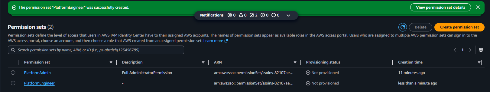
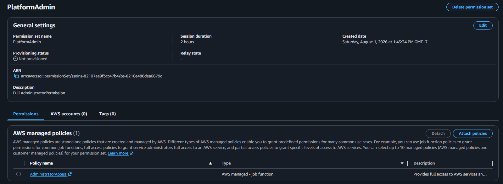
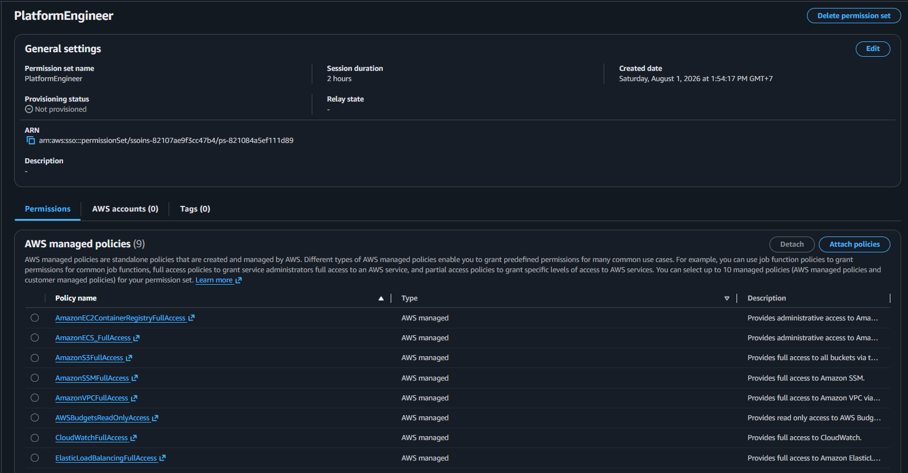

# AWS IAM Identity Center Permission Sets

## Overview

Permission Sets define the level of access granted to users after they authenticate through AWS IAM Identity Center.

Instead of assigning IAM policies directly to users, this project manages permissions using Permission Sets, providing centralized and scalable access management.

Two Permission Sets are defined for the project:

- PlatformAdmin
- PlatformEngineer

---

# Objective

Define standardized Permission Sets for project members following AWS best practices for centralized identity and access management.

---

# Why This Matters

Permission Sets simplify access management by separating authentication from authorization.

Using Permission Sets provides several benefits:

- Centralized permission management
- Consistent access control
- Easier onboarding and offboarding
- Better scalability as the project grows
- Integration with AWS CLI SSO

---

# Architecture

```text
                IAM Identity Center
                        │
        ┌───────────────┴───────────────┐
        │                               │
 PlatformAdmin                  PlatformEngineer
        │                               │
        └───────────────┬───────────────┘
                        │
                  AWS Account
```

---

# Permission Set Design

## PlatformAdmin

### Purpose

Project owner with full administrative access to the AWS account.

### Managed Policies

- AdministratorAccess

### Responsibilities

- Manage AWS infrastructure
- Configure IAM Identity Center
- Manage Permission Sets
- Configure AWS Budgets
- Review infrastructure changes
- Approve Pull Requests

---

## PlatformEngineer

### Purpose

Project contributor responsible for developing and deploying infrastructure without managing AWS account administration.

### Managed Policies

- AmazonECS_FullAccess
- AmazonEC2ContainerRegistryFullAccess
- AmazonVPCFullAccess
- ElasticLoadBalancingFullAccess
- CloudWatchFullAccess
- AmazonSSMFullAccess
- AmazonS3FullAccess
- IAMReadOnlyAccess
- AWSBudgetsReadOnlyAccess

### Responsibilities

- Develop infrastructure using Terraform
- Deploy containerized applications
- Manage ECS services
- Manage ECR repositories
- Configure networking resources
- Configure CloudWatch dashboards and alarms
- Manage Parameter Store
- Access project resources through AWS CLI SSO

---

# Permission Comparison

| Capability | PlatformAdmin | PlatformEngineer |
|------------|:-------------:|:----------------:|
| Full AWS Administration | ✅ | ❌ |
| Manage IAM Identity Center | ✅ | ❌ |
| Create Permission Sets | ✅ | ❌ |
| Manage Users | ✅ | ❌ |
| Deploy ECS Services | ✅ | ✅ |
| Manage ECR | ✅ | ✅ |
| Manage VPC Resources | ✅ | ✅ |
| Manage ALB | ✅ | ✅ |
| Manage CloudWatch | ✅ | ✅ |
| Manage SSM Parameter Store | ✅ | ✅ |
| Manage S3 Buckets | ✅ | ✅ |
| View IAM Configuration | ✅ | ✅ |
| Modify IAM Resources | ✅ | ❌ |
| View AWS Budgets | ✅ | ✅ |
| Modify AWS Budgets | ✅ | ❌ |

---

# Current Limitation

The `PlatformEngineer` Permission Set currently provides access to the AWS services required for the project but does **not** allow creating or modifying IAM resources.

Terraform configurations that require IAM role creation or `iam:PassRole` permissions will initially be executed using the `PlatformAdmin` Permission Set.

A project-scoped custom IAM policy will be introduced during the Terraform milestone after the required IAM resources and naming conventions have been finalized.

---

# Verification

The following verification steps have been completed:

- PlatformAdmin Permission Set has been created.
- PlatformEngineer Permission Set has been created.
- Managed Policies have been attached successfully.
- Permission Sets are available for account assignment.

---

# Lessons Learned

- Permission Sets provide centralized authorization for users authenticated through IAM Identity Center.
- Authentication and authorization are managed independently.
- AWS Managed Policies allow rapid project setup while maintaining reasonable security.
- The Principle of Least Privilege should be refined as infrastructure requirements become clearer.
- IAM permissions required by Terraform should be granted incrementally rather than upfront.

---

## Screenshots

### Permission Sets Overview



### PlatformAdmin Permission Set



### PlatformEngineer Permission Set



# References

- AWS IAM Identity Center Documentation
- AWS IAM Identity Center Permission Sets
- AWS IAM Best Practices