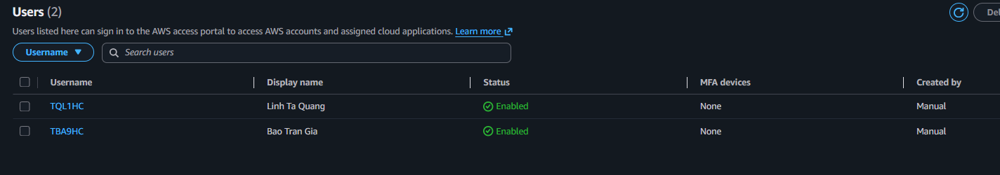
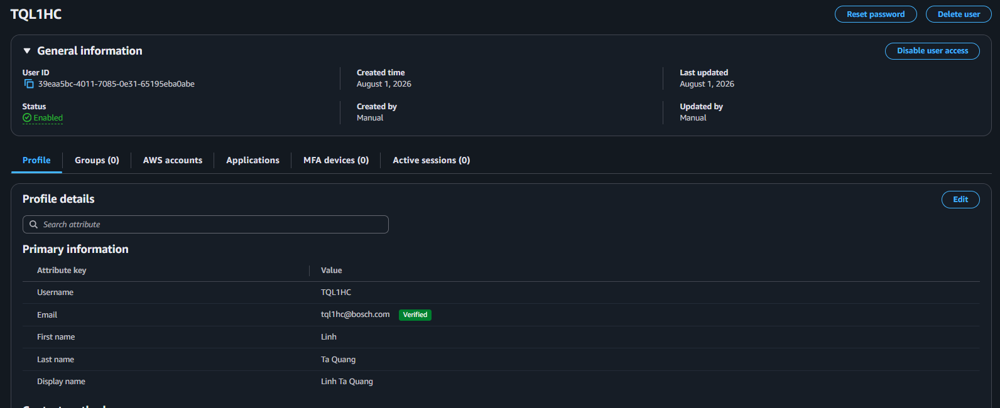
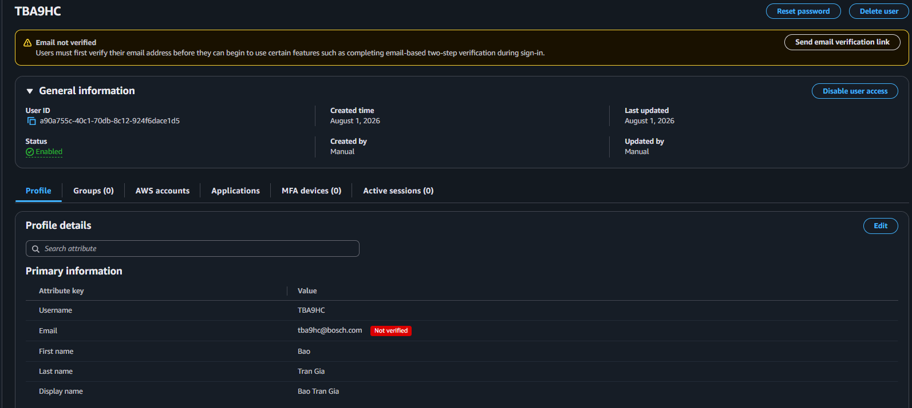
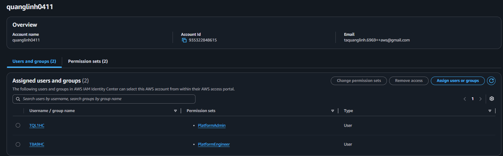

# AWS IAM Identity Center Users

## Overview

AWS IAM Identity Center allows project members to access the AWS account using individual identities instead of sharing credentials.

Each team member is assigned a dedicated Permission Set based on their responsibilities within the project.

This project currently has two users:

- Project Owner
- Project Contributor

---

# Objective

Create project users and assign the appropriate Permission Sets to enable secure access to the AWS account.

---

# Why This Matters

Every team member should have an individual identity when accessing AWS resources.

Using dedicated users provides several benefits:

- No shared credentials
- Better security
- Individual audit trail
- Easier onboarding and offboarding
- Centralized access management

---

# Architecture

```text
                   IAM Identity Center
                            │
        ┌───────────────────┴───────────────────┐
        │                                       │
  Project Owner                        Project Contributor
        │                                       │
 PlatformAdmin Permission Set      PlatformEngineer Permission Set
        │                                       │
        └───────────────────┬───────────────────┘
                            │
                      AWS Account
```

---

# User Assignment

| User | Permission Set | Purpose |
|------|----------------|---------|
| Project Owner | PlatformAdmin | Project administration |
| Project Contributor | PlatformEngineer | Infrastructure development |

---

# Access Workflow

1. User receives an invitation email from AWS IAM Identity Center.
2. User activates the account and sets a password.
3. User signs in through the AWS Access Portal.
4. User selects the AWS account.
5. User selects the assigned Permission Set.
6. AWS grants temporary credentials for the session.

---

# Verification

The following verification steps have been completed:

- Project Owner account has been created.
- Project Contributor account has been created.
- Both users have been assigned the correct Permission Set.
- Both users can successfully sign in to the AWS Access Portal.
- Both users can access the AWS account.

---

# Lessons Learned

- Each team member should have an individual identity.
- Permission Sets simplify user permission management.
- IAM Identity Center provides temporary credentials instead of long-lived access keys.
- User access can be managed centrally without creating IAM Users.
- Assigning users through Permission Sets makes permission management more scalable.

---

# Screenshots

## Users Overview



---

## Project Owner User



---

## Project Contributor User



---

## AWS Account Assignment



---

---

# References

- AWS IAM Identity Center Documentation
- AWS IAM Identity Center User Guide
- AWS IAM Best Practices