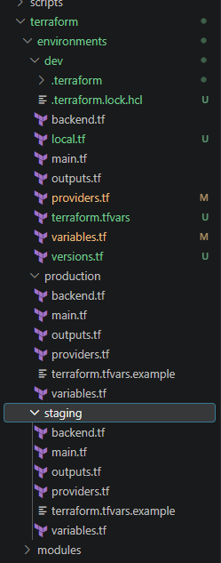
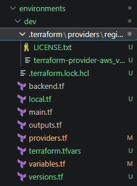
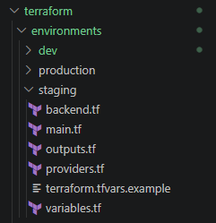
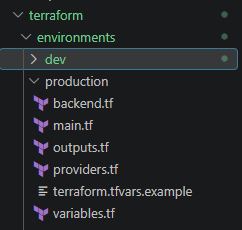
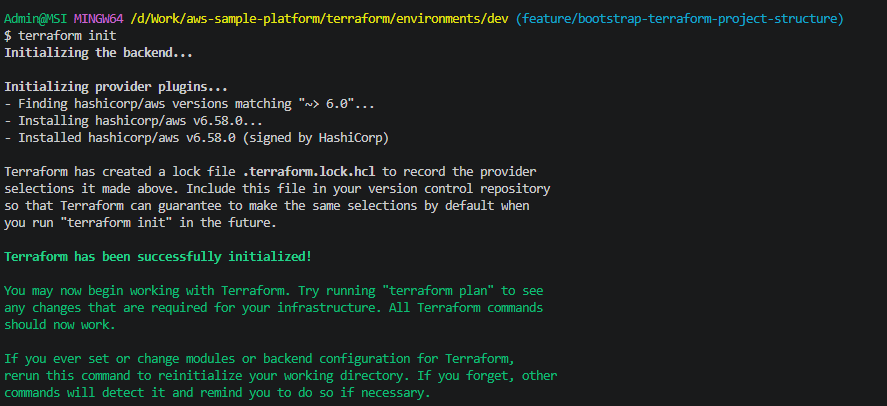

# Terraform Project Structure

## Overview

This document describes the Terraform repository structure adopted in this project.

The infrastructure is organized into multiple deployment environments, where each environment acts as an independent Terraform root module.

At this stage, the project intentionally prioritizes simplicity and learning over abstraction. Terraform modules will be introduced in a later milestone once the infrastructure becomes more mature.

---

# Objective

Establish a clean, maintainable, and scalable Terraform repository structure that supports multiple deployment environments while remaining easy to understand.

---

# Why This Matters

A well-structured Terraform repository provides several benefits:

- Improves readability
- Simplifies collaboration
- Reduces onboarding time
- Makes infrastructure easier to maintain
- Prepares the project for future production deployments

---

# Repository Structure

```text
terraform/
├── environments/
│   ├── dev/
│   │   ├── backend.tf
│   │   ├── providers.tf
│   │   ├── versions.tf
│   │   ├── variables.tf
│   │   ├── terraform.tfvars
│   │   ├── locals.tf
│   │   ├── outputs.tf
│   │   ├── main.tf
│   │   └── README.md
│   │
│   ├── staging/
│   │   ├── backend.tf
│   │   ├── providers.tf
│   │   ├── versions.tf
│   │   ├── variables.tf
│   │   ├── terraform.tfvars
│   │   ├── locals.tf
│   │   ├── outputs.tf
│   │   ├── main.tf
│   │   └── README.md
│   │
│   └── production/
│       ├── backend.tf
│       ├── providers.tf
│       ├── versions.tf
│       ├── variables.tf
│       ├── terraform.tfvars
│       ├── locals.tf
│       ├── outputs.tf
│       ├── main.tf
│       └── README.md
│
└── README.md
```

---

# Environment Strategy

The project defines three deployment environments.

| Environment | Purpose |
|-------------|---------|
| Development | Daily development and testing |
| Staging | Pre-production validation |
| Production | Production deployment |

Each environment maintains:

- Its own Terraform backend
- Its own Terraform state
- Its own variable values
- Its own deployment lifecycle

This isolation prevents changes in one environment from affecting another.

---

# File Responsibilities

| File | Responsibility |
|------|----------------|
| backend.tf | Configure the Terraform backend |
| versions.tf | Define Terraform and provider version requirements |
| providers.tf | Configure the AWS provider |
| variables.tf | Define input variables |
| terraform.tfvars | Store environment-specific values |
| locals.tf | Define reusable local values |
| outputs.tf | Export Terraform outputs |
| main.tf | Define infrastructure resources |
| README.md | Environment-specific documentation |

---

# Terraform Workflow

Terraform commands are executed from the target environment directory.

Example:

```bash
cd terraform/environments/dev

terraform init

terraform plan

terraform apply

terraform destroy
```

Each environment operates independently and maintains its own Terraform state.

---

# Design Decisions

The project intentionally does **not** introduce reusable Terraform modules during the initial implementation.

Instead, each environment is implemented as an independent Terraform root module.

This approach was selected because it:

- Keeps the repository easy to understand.
- Reduces the Terraform learning curve.
- Makes it easier to understand how Terraform loads configuration files.
- Allows contributors to focus on Infrastructure as Code fundamentals before introducing additional abstraction.

As the project grows, infrastructure components may be extracted into reusable Terraform modules.

---

# Future File Organization

Initially, all infrastructure resources will be implemented in `main.tf`.

When the infrastructure becomes larger, resources may be separated into dedicated files.

Example:

```text
main.tf
network.tf
ecs.tf
alb.tf
ecr.tf
monitoring.tf
```

Files will only be separated when doing so improves readability and maintainability.

---

# Verification

The following verification steps have been completed.

- Terraform repository structure has been created.
- Three deployment environments have been prepared.
- Required Terraform configuration files have been created.
- Terraform initializes successfully.
- Terraform validates successfully.

---

# Lessons Learned

- Every environment can function as an independent Terraform root module.
- Terraform automatically loads every `.tf` file within the current working directory.
- Infrastructure should be organized for readability before optimization.
- Simplicity is often preferable during the early stages of Infrastructure as Code adoption.
- Repository structure should evolve as the infrastructure grows.

---

# Screenshots

## Terraform Repository Structure



---

## Development Environment Structure



---

## Staging Environment Structure



---

## Production Environment Structure



---

## Terraform Initialization



---

# References

- HashiCorp Terraform Documentation
- Terraform CLI Documentation
- Terraform Style Guide